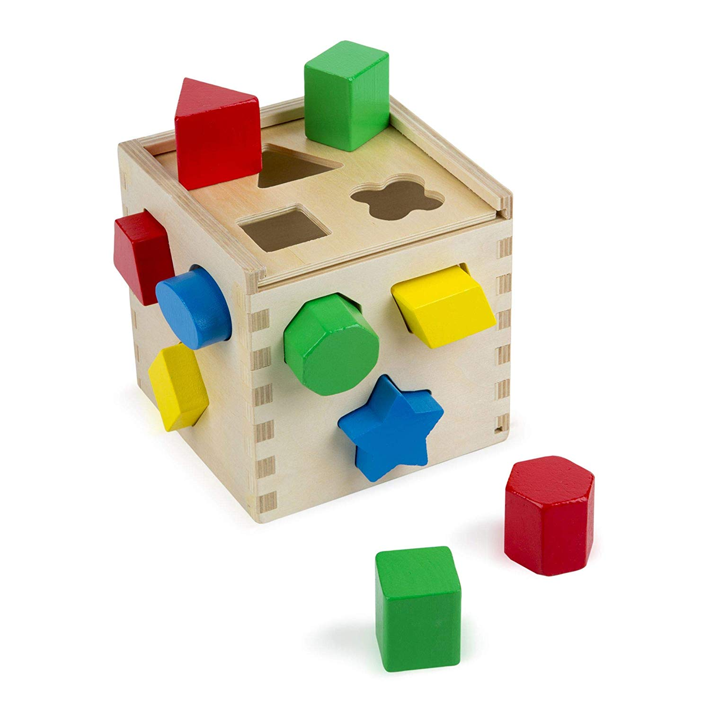
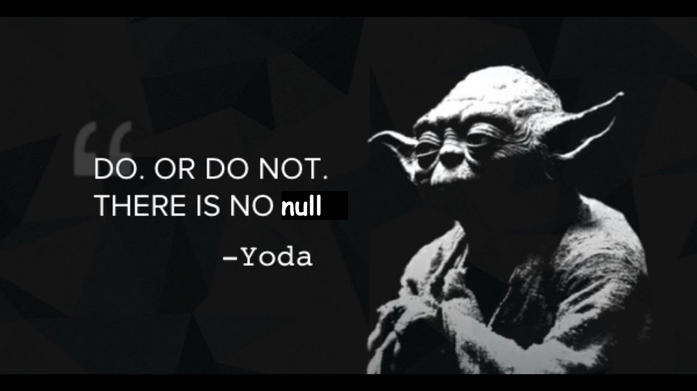
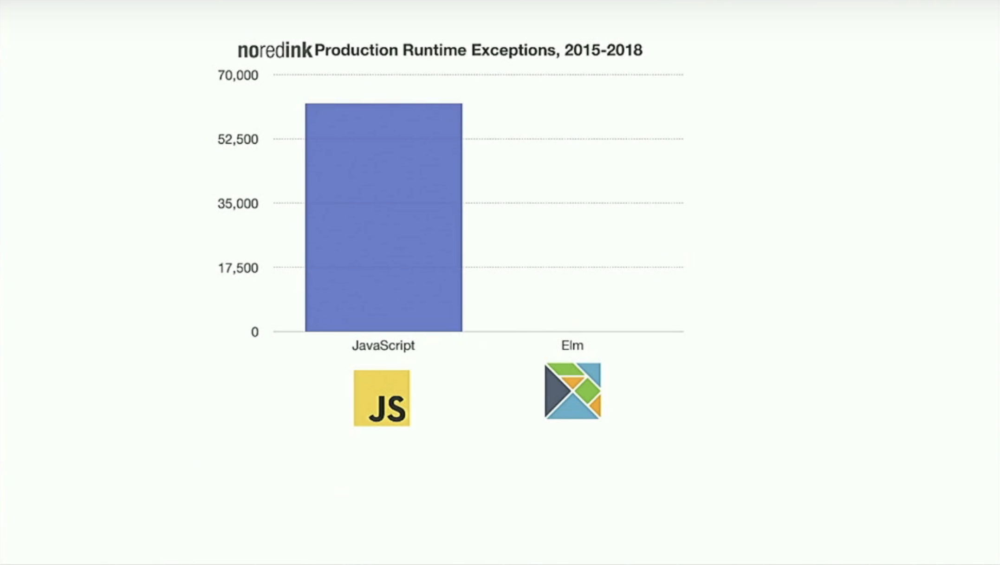
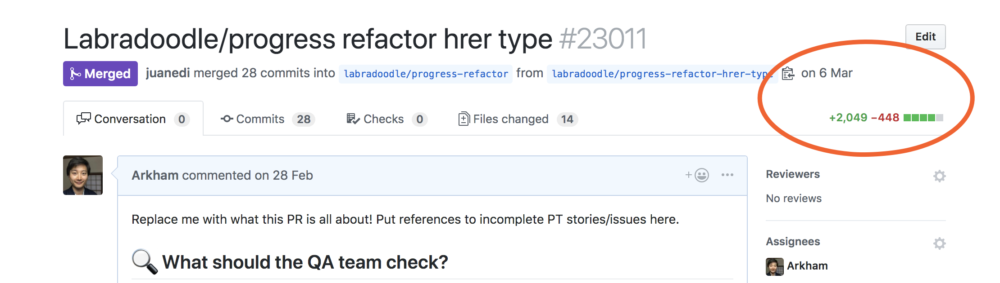
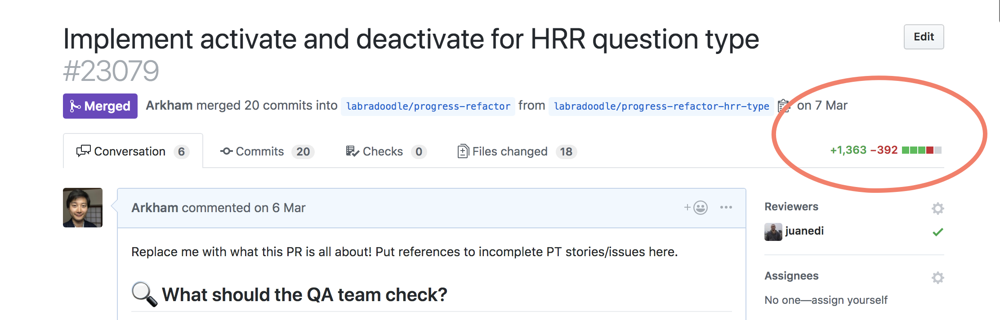

footer: Lambda Aλhambra Day / **@arkh4m**
theme: Work, 3
build-lists: true

# Serving
# Millions
# of Users
# with Elm


---

# Hello! 🐒

---

# My name is Ju 🙇🏻‍♂️

---

# who-am-i

- I was born in 🇨🇳
- Grew up in 🇮🇹
- Live in 🇬🇧
- Write at [juliu.is](https://juliu.is)
- Work for no-red-ink

---

# [noredink.com](noredink.com)

- Students learn writing in English
- Teachers can assign them work
- We're hiring!

---

# Why am I here?

---

# [Why isn't Functional Programming the Norm?](https://www.youtube.com/watch?v=QyJZzq0v7Z4)

---

# My goal today

Flex some FP in the real world 🦾

---

# Backend Stack

- Multiple backend services written in:
  - Ruby/Rails
  - Elixir/Phoenix
  - Haskell

---

# Frontend Stack

- 99.9% Elm

---


# Some stats!

---

```
$ cloc --include-ext=elm monolith/ui/src
-----------------------------------------------
Language    files    blank    comment      code
-----------------------------------------------
Elm          1506    49759      16535    211835
-----------------------------------------------
```

---

```
$ cloc --include-ext=elm monolith/ui/tests
-----------------------------------------------
Language    files    blank    comment      code
-----------------------------------------------
Elm           569    10275       1309    200586
-----------------------------------------------
```

---

```
$ cloc --include-ext=elm monolith/ui/generated
-----------------------------------------------
Language    files    blank    comment      code
-----------------------------------------------
Elm           129     2428       1728     26399
-----------------------------------------------
```

---

# DEMO? DEMO! 🍩

---

# What is Elm?

- A **statically typed** functional programming language
- Designed to build frontend webapps
- Compiles to JavaScript

---

# Functions

```elm
add x y = x + y
```

---

# Function Signatures ✍️

```elm
add : Int -> Int -> Int
add x y = x + y
```

---

# Currying 🍛

```elm
add : Int -> Int -> Int
add x y = x + y

add1 : Int -> Int
add1 = add 1

result : Int
result = add1 4 -- 5
```

---

# In Elm a function can only take a **single** argument

---


---

# Function Signatures, Pt II

[.code-highlight: 1-2]
[.code-highlight: 1-5]

```elm
add : Int -> (Int -> Int)
add x y = x + y

add1 : Int -> Int
add1 = add 1 -- this is now waiting for a y
```

---

# Function Signatures, Pt III

```js
const array = [1, 4, 9, 16];
array.map(x => x * 2); // [2, 8, 18, 32]
```

---

# Function Signatures, Pt III

[.code-highlight: 1-2]
[.code-highlight: 1-4]
[.code-highlight: 1-8]

```elm
array = [1, 4, 9, 16]
List.map (\x -> x * 2) array -- [2, 8, 18, 32]

-- List.map : (a -> b) -> List a -> List b

doubleEverything: List Int -> List Int
doubleEverything list =
    List.map (\x -> x * 2) list
```

---

# Function Signatures, Pt IV

[.code-highlight: 1-4]
[.code-highlight: 1-7]
[.code-highlight: 1-10]

```elm
-- List.map : (a -> b) -> List a -> List b

specializedMap : (Int -> String) -> List Int -> List String
specializedMap fun list = List.map fun list

specializedMap (\x -> String.fromInt x) [1, 2, 3]
// ["1","2","3"]

specializedMap (\x -> x * 2) [1, 2, 3]
// ???
```

---

```
Type Mismatch
Line 55, Column 21
The 1st argument to `specializedMap` is not what I expect:

55|     specializedMap (\x -> x * 2) [1,2,3]
                        ^^^^^^^^^^^
This argument is an anonymous function of type:

    Int -> Int

But `specializedMap` needs the 1st argument to be:

    Int -> String

Hint: Want to convert an Int into a String? Use the String.fromInt function!
```

---

# **ELI5**<br>Function Signatures



---

# But.. what about arguments<br>that can be `null`?


---

# Well..

---



---

# Let's say we want to grab<br>the first element of a list

---

```elm
List.head : List a -> Maybe a
```

---

```
> List.head []
Nothing

> List.head [1, 2, 3]
Just 1
```

---

[.code-highlight: 1-3]
[.code-highlight: 1-6]
[.code-highlight: 1-8]

```elm
headToString : List Int -> String
headToString list =
    case List.head list of
        Just value ->
            String.fromInt value

        Nothing ->
            "List was empty, I'm sorry"
```

---

# Custom Types

```elm
type Suit
    = Green
    | Yellow
    | Red
    | Blue
```

---

# Exhaustive pattern matching

```Elm
toString : Suit -> String
toString suit =
    case suit of
        Green ->
            "Green"

        Yellow ->
            "Yellow"

        Red ->
            "Red"

        Blue ->
            "Blue"
```

---

# A new color appears

```elm
type Suit
    = Green
    | Yellow
    | Red
    | Blue
    | Pink
      ^^^^
```

---

```
This `case` does not have branches for all possibilities:

19|>    case suit of
20|>        Green ->
21|>            "Green"
22|>
23|>        Yellow ->
24|>            "Yellow"
25|>
26|>        Red ->
27|>            "Red"
28|>
29|>        Blue ->
30|>            "Blue"

Missing possibilities include:

    Pink
```

---

# 😲

---

# **DEMO TIME** 🎸

## [Hello World](https://ellie-app.com/dyGBYk67KMLa1)

---

# **DEMO TIME** 🖌

## [Mondrian](https://ellie-app.com/dyGBsQ8bSMwa1)

---

# How safe is it really?

---



---




---



---


---


---

# The compiler is your friend 💓

---

# A REAL DEMO 🍔

---

# Thank you! 🙏

[github.com/Arkham/lambda-alhambra](https://github.com/Arkham/lambda-alhambra)

🦆 [@arkh4m](https://twitter.com/arkh4m)
✍️  [juliu.is](https://juliu.is)
